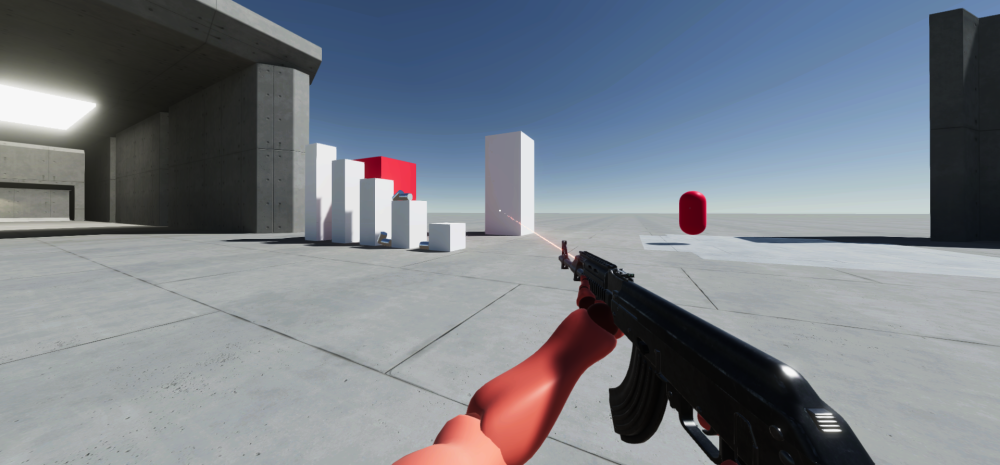

# LootyShooty

 

A work in progress multiplayer first person shooter in Unity with the new [FisNet Networking](https://github.com/FirstGearGames/FishNet).

## TODO

- [x] Server Authoritive movement
- [x] Client Side Predition & Reconciliation
- [x] Headless server
- [x] Lootable guns
- [x] Hitbox region multiplier
- [x] Hitmarkers
- [ ] Hybrid projectile/hitscan bullets
- [ ] Deterministic spray patterns
